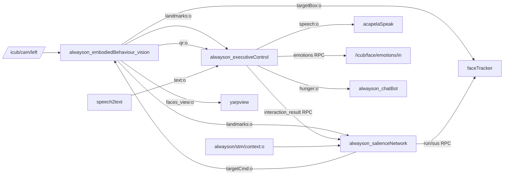

This repository provides the **embodied behaviour module** for the iCub humanoid robot, functioning as a core subsystem of the [Developmental Cognitive Architecture](https://gitlab.iit.it/cognitiveInteraction/developmental-cognitive-architecture.git). It serves as the foundation for the robot's always-on social interaction stack.

At its core, the module synthesizes a primary internal homeostatic motivation, the **Orexigenic Drive**. By embedding this drive directly into the continuous cognitive architecture, it enables the iCub to exhibit autonomous, lifelike, and drive-regulated social behaviors over extended periods.

## Tech Stack

<table>
<tr>
<td align="center" width="33%">
<br>
P R O G R A M M I N G
</td>
<td align="center" width="33%">
<br>
V I S I O N &nbsp;&amp;&nbsp; M L &nbsp;&amp;&nbsp; A I
</td>
<td align="center" width="33%">
<br>
T O O L S &nbsp;&amp;&nbsp; S T O R A G E
</td>
</tr>
<tr>
<td align="center">
<br>
<br>

</td>
<td align="center">
<br>
<br>
<br>
<br>
<br>
<br>

</td>
<td align="center">
<br>
<br>
<br>
<br>

</td>
</tr>
</table>

## Architecture Overview

**Core modules**
- **alwayson_embodiedBehaviour_vision**: Perception pipeline (YOLO + MediaPipe + face ID). Produces landmarks, annotated face view, QR data, and target bounding boxes.
- **alwayson_salienceNetwork**: Selects the most salient face via IPS, manages interaction gating and cooldowns, and drives face tracking.
- **alwayson_executiveControl**: Orchestrates the interaction state machine, speech I/O, Orexigenic drive model, QR-based feeding, and LLM-driven dialogue.
- **alwayson_chatBot**: Telegram interface driven by the same Orexigenic state and prompts.

**External modules**
- [speech2text](https://gitlab.iit.it/cognitiveInteraction/speech2text)
- [acapelaSpeak](https://gitlab.iit.it/cognitiveInteraction/acapelaspeech)
- [Developmental Cognitive Architecture](https://gitlab.iit.it/cognitiveInteraction/developmental-cognitive-architecture.git)
- [faceTracker](https://gitlab.iit.it/cognitiveInteraction/faceTracker.git)

### Interaction Flow (High Level)
1. Vision processes camera frames and publishes per-face landmarks, annotated face view, and QR events.
2. SalienceNetwork ranks faces by IPS, selects a target, and streams a lightweight `targetCmd` (track ID + IPS) to vision.
3. Vision resolves the target's bounding box and streams `targetBox` to FaceTracker for gaze/pose control.
4. ExecutiveControl runs the social state machine, consuming landmarks, STT, and QR, then dispatching speech and LLM-driven responses.
5. ExecutiveControl publishes the Orexigenic state used by ChatBot for Telegram interactions.
6. ExecutiveControl returns compact interaction results (homeostatic reward, energy cost, outcome) to SalienceNetwork via RPC, tying IPS weight learning to drive reduction.

### Module Interaction Map



## Modules and Features

### alwayson_embodiedBehaviour_vision

- Real-time face detection (YOLO v11) and tracking (ByteTrack) with a 10% bounding box expansion for better crop quality.
- MediaPipe face landmark estimation: head pose via PnP (pitch, yaw, roll), gaze direction vector, and attention classification (`MUTUAL_GAZE` / `NEAR_GAZE` / `AWAY`).
- Talking detection via lip motion history: standard deviation of normalized mouth opening over a rolling buffer.
- Zone classification (`FAR_LEFT`, `LEFT`, `CENTER`, `RIGHT`, `FAR_RIGHT`) and distance classification (`SO_CLOSE`, `CLOSE`, `FAR`, `VERY_FAR`) per face.
- Face identity matching with `face_recognition`: sticky identity across frames, per-track retry logic, runtime enrollment via RPC.
- QR code detection (OpenCV, throttled to 1 in 10 frames) with hysteresis to suppress repeated emits.
- Annotated face view output and lightweight `targetCmd` → `targetBox` relay for FaceTracker.
- Optical flow motion detection and HSV-based light level estimation.

**RPC port**: `/alwayson/vision/rpc` (configurable with `rpc_name`)
**Commands**:
- `help` → list commands
- `name <person_name> id <track_id>` → enroll or update a tracked face identity
- `quit` → stop module

---

### alwayson_salienceNetwork

- Computes **IPS (Interaction Priority Score)** per face as a weighted sum of four variables: proximity (bbox area), centrality (screen center distance), approach velocity (bbox area delta), and mutual gaze angle.
- **Social state classification**: `ss1` = unknown, `ss2` = known not greeted, `ss3` = known greeted no talk, `ss4` = known talked. Each state has its own IPS threshold (ss1 strictest, ss2 most permissive).
- **Hysteresis**: active target gets an IPS bonus (0.3) to prevent thrashing.
- **Habituation**: per-person IPS is attenuated exponentially (λ=0.20) the longer a face is continuously targeted, driving the robot toward novel faces.
- **Adaptive IPS weights**: per-person proximity/centrality/velocity/gaze weights shift based on homeostatic reward after each interaction (reward-weighted gradient, max shift 0.08 per interaction).
- **Context-aware cooldown**: STM context label (1=lively → short cooldown; 0=calm → long cooldown; −1=default) adjusts interaction frequency.
- **Unknown person dwell gate**: an unresolved (SS1) face must be continuously present for at least 7.5 seconds before an interaction can be triggered; resolving to a known identity clears the timer immediately.
- Sends `run` to FaceTracker at startup and `sus` at shutdown.
- Persists daily memory to JSON: `greeted_today.json`, `talked_today.json`, `last_greeted.json`, `homeostatic_learning.json`.

**RPC port**: `/<module_name>` (default: `/salienceNetwork`)
**Commands** (received from executiveControl):
- `set_track_id <int>` → override target selection
- `reset_cooldown <face_id> <track_id>` → reset cooldown for a specific target
- `interaction_result <json>` → deliver interaction outcome for homeostatic learning

---

### alwayson_executiveControl

- **Social state machine**: ss1 (unknown → greet + extract name → ss3), ss2 (known, not greeted → say hello → ss3), ss3 (known, greeted → LLM conversation up to 3 turns → ss4), ss4 (no-op).
- **Orexigenic drive model** (`HungerModel`): stomach level drains continuously over 5 hours. Thresholds: ≥60% = HS1 (full), 25–60% = HS2 (hungry), <25% = HS3 (starving). Level and timestamps persist atomically to `memory/hunger_state.json`.
- **Active energy costs**: each meaningful robot action (greeting, name question, conversation turn, feed acknowledgment) exerts a metabolic cost that accelerates stomach drain.
- **QR-based feeding**: reads QR codes from vision (`/alwayson/executiveControl/qr:i`). Recognized payloads: `SMALL_MEAL` (+10%), `MEDIUM_MEAL` (+25%), `LARGE_MEAL` (+45%). Speaks a context-aware acknowledgment and logs a `qr_feed` reactive event.
- **Reactive greeting path**: independently listens to STT for greeting utterances (hello, hi, ciao, etc.). When idle, responds reactively without requiring the proactive interaction flow to be triggered. At HS3, the reactive response skips the normal greeting and immediately delivers a combined greeting + hunger request ("Hello, I'm so hungry, would you feed me please?").
- **Face emotion**: sets iCub facial expression via `/icub/face/emotions/in` on HS transitions and at startup (HS1: all happy; HS2: mouth sad, eyebrows neutral; HS3: mouth + eyebrows fully sad).
- **`LatestOnlyLlmWorker`**: bounded parallel LLM execution (up to 3 concurrent calls) with cancel-on-supersede semantics and streaming support.
- **`SpeechCoordinator`**: non-blocking TTS timing tracker that allows the dialogue loop to continue without hard waits.
- Publishes current Orexigenic state to `/alwayson/executiveControl/hunger:o`.

**RPC port**: `/<module_name>` (default: `/executiveControl`)
**Commands**:
- `status` or `ping` → module state (busy, mode, hunger level)
- `help` → command list
- `hunger_mode <on|off>` → enable/disable the Orexigenic drive (off publishes HS0, resets stomach to 100%)
- `hunger <hs0|hs1|hs2|hs3>` → manually set drive: `hs0`=disable drive, `hs1`=full (100%), `hs2`=hungry (59%), `hs3`=starving (24%)
- `run <track_id> <face_id> <ss1|ss2|ss3|ss4>` → trigger an interaction
- `quit` → stop module

---

### alwayson_chatBot

- Telegram long-polling bot (dedicated background thread) with exponential backoff and rate-limit handling.
- **Per-user memory**: name, age, likes, dislikes, favorite topics, inside jokes (with frequency tracking), and conversation style (tone, message length, emoji usage) — persisted to SQLite.
- **Conversation history**: rolling 6-turn window with automatic summarization every 8 turns; summaries are injected into the system prompt to maintain long-term context.
- **Orexigenic-drive-aware prompting**: HS-specific system prompt overlays. In HS3, a critical override forces the entire reply to be about starvation.
- **HS2 hunger injection**: if 3 consecutive replies pass without a hunger mention, the next reply forces a casual hunger side-comment.
- **Proactive messages**:
  - HS1 → HS2 transition: sends a casual "peckish" message to all subscribers.
  - HS3 entry: broadcasts immediately to all subscribers, then re-sends every 15 minutes (per-user cooldown) while starving.
  - HS3 → HS1/HS2 recovery: sends a relief message to all subscribers on feeding.
- **Telegram user commands**: `/start` (register as subscriber, clear history), `/reset` (clear conversation history and start fresh).
- **RPC port**: `/chatBot/rpc`
- **RPC commands**:
  - `status` → module status (effective HS, subscriber count, thread health)
  - `help` → command list
  - `set_hs <HS0|HS1|HS2|HS3>` → force Orexigenic state via RPC
  - `clear_hs` → clear RPC-forced state (revert to port-driven state)
  - `reload_prompts` → hot-reload `prompts.json` without restart

---

## YARP Ports and Connections

**Modules**

| Module | Type | Node |
|---|---|---|
| `alwayson_alwayson_embodiedBehaviour_vision` | core | icubsrv |
| `alwayson_salienceNetwork` | core | icubsrv |
| `alwayson_executiveControl` | core | icubsrv |
| `alwayson_chatBot` | core | icubsrv |
| `faceTracker` | external | icubsrv |
| `yarpview` | viewer | localhost |

**Data Connections**

| From | To | Protocol |
|---|---|---|
| `/icub/cam/left` | `/alwayson/vision/img:i` | tcp |
| `/alwayson/vision/faces_view:o` | `/yarpview/vision_faces_view:i` | tcp |
| `/alwayson/vision/landmarks:o` | `/alwayson/executiveControl/landmarks:i` | tcp |
| `/alwayson/vision/landmarks:o` | `/alwayson/salienceNetwork/landmarks:i` | tcp |
| `/alwayson/vision/qr:o` | `/alwayson/executiveControl/qr:i` | tcp |
| `/alwayson/vision/targetBox:o` | `/faceTracker/faceCoordinate:i` | tcp |
| `/alwayson/salienceNetwork/targetCmd:o` | `/alwayson/vision/targetCmd:i` | tcp |
| `/alwayson/stm/context:o` | `/alwayson/salienceNetwork/context:i` | tcp |
| `/alwayson/executiveControl/hunger:o` | `/alwayson/chatBot/hunger:i` | tcp |
| `/speech2text/text:o` | `/alwayson/executiveControl/stt:i` | tcp |
| `/alwayson/executiveControl/speech:o` | `/acapelaSpeak/speech:i` | tcp |
| `/acapelaSpeak/bookmark:o` | `/speech2text/bookmark:i` | tcp |

**RPC Connections** (established lazily at first use)

| From | To | Purpose |
|---|---|---|
| `/salienceNetwork/executiveControl:rpc` | `/executiveControl` | trigger interactions, get status |
| `/salienceNetwork/faceTracker:rpc` | `/faceTracker` | `run` at startup, `sus` at shutdown |
| `/executiveControl/salienceNetwork/rpc` | `/salienceNetwork` | deliver interaction results |
| `/executiveControl/vision/rpc` | `/alwayson/vision/rpc` | submit face name enrollment |
| `/executiveControl/emotions/rpc` | `/icub/face/emotions/in` | set face expression on HS change |

---

## Installation

```bash
cmake ..
make
make install
```

## Configuration Notes (Crucial)

- **YARP**: Ensure `yarpserver` is running and network is configured.
- **LLM config**: Copy `modules/llm.env.template` to `modules/llm.env` and fill in your Azure OpenAI credentials (used by ExecutiveControl and ChatBot).
- **Face models**: Vision auto-downloads the YOLO face model on first run; ensure network access or place the model file locally. The MediaPipe `face_landmarker.task` model is bundled in the repository and installed automatically into the `alwaysOn` YARP context during `make install`.
- **Python deps**: `requirements.txt` is installed during the build; use a virtualenv if running modules manually.

## Data Collection

Runtime SQLite databases are stored under `modules/data_collection/`.

| Database | Contents |
|---|---|
| `executive_control.db` | Proactive interactions, reactive events (greetings, QR feeds), and continuous `hunger_level_events` timeline |
| `salience_network.db` | Target selections, face IPS events with habituation data, social state changes, homeostatic learning deltas, and interaction attempts |
| `chat_bot.db` | Telegram chat events, per-user memory snapshots, subscriber registry, and Orexigenic state at each message |

**Analysis views**

*executive_control.db*: `v_proactive_interactions`, `v_metric_ss3_daily`, `v_metric_response_rate_daily`, `v_metric_repeat_users_daily`, `v_metric_depth_progression`, `v_hunger_level_timeline`

*salience_network.db*: `v_face_ips_timeline`, `v_interaction_attempts_clean`, `v_interaction_attempts_daily`

*chat_bot.db*: `v_chat_events_clean`, `v_chat_daily_metrics`, `v_chat_user_daily`

## Running

Typical flow (YARP Manager or CLI):
- Load the application XML: [app/alwaysOn-embodiedBehaviour/scripts/alwaysOn-embodiedBehaviour.xml](app/alwaysOn-embodiedBehaviour/scripts/alwaysOn-embodiedBehaviour.xml)
- Start external modules (speech2text, acapelaSpeak, STM context, faceTracker)
- Run the always-on modules and establish the connections above

---

**Author:** Nima Abaeian  
**Institution:** Istituto Italiano di Tecnologia (IIT)  
**Lab:** Cognitive Architecture for Collaborative Technologies
