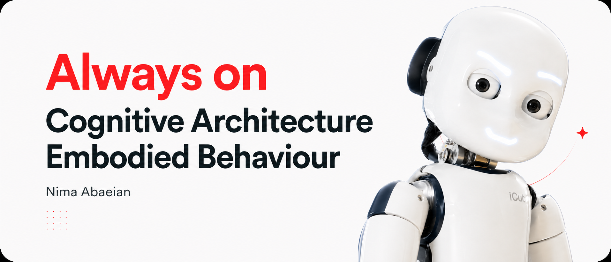
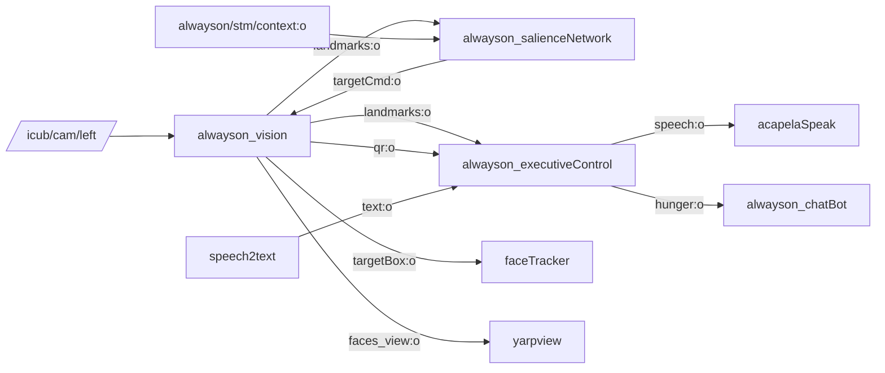

This repository provides the **embodied behaviour module** for the iCub humanoid robot, functioning as a core subsystem of the [Developmental Cognitive Architecture](https://gitlab.iit.it/cognitiveInteraction/developmental-cognitive-architecture.git). It serves as the foundation for the robot's always-on social interaction stack.

At its core, the module synthesizes a primary internal homeostatic motivation, the **Orexigenic Drive**. By embedding this drive directly into the continuous cognitive architecture, it enables the iCub to exhibit autonomous, lifelike, and drive-regulated social behaviors over extended periods.

## Tech Stack

<table>
<tr>
<td align="center" width="33%">
<br>
P R O G R A M M I N G
</td>
<td align="center" width="33%">
<br>
V I S I O N &nbsp;&amp;&nbsp; M L &nbsp;&amp;&nbsp; A I
</td>
<td align="center" width="33%">
<br>
T O O L S &nbsp;&amp;&nbsp; S T O R A G E
</td>
</tr>
<tr>
<td align="center">
<br>
<br>

</td>
<td align="center">
<br>
<br>
<br>
<br>
<br>
<br>

</td>
<td align="center">
<br>
<br>
<br>
<br>

</td>
</tr>
</table>

## Architecture Overview

**Core modules**
- **alwayson_vision**: Perception pipeline (YOLO + MediaPipe + face ID). Produces landmarks, face view, QR data, and target boxes.
- **alwayson_salienceNetwork**: Selects the most salient face, manages interaction gating and cooldowns, and drives face tracking.
- **alwayson_executiveControl**: Orchestrates interaction flow, speech I/O, Orexigenic drive model, and LLM-driven dialog.
- **alwayson_chatBot**: Telegram interface driven by the same Orexigenic state and prompts.

**External modules**
- [speech2text](https://gitlab.iit.it/cognitiveInteraction/speech2text)
- [acapelaSpeak](https://gitlab.iit.it/cognitiveInteraction/acapelaspeech)
- [Developmental Cognitive Architecture](https://gitlab.iit.it/cognitiveInteraction/developmental-cognitive-architecture.git)
- [faceTracker](https://gitlab.iit.it/cognitiveInteraction/faceTracker.git)

### Interaction Flow (High Level)
1. Vision processes camera frames and publishes landmarks, face detections, and QR events.
2. SalienceNetwork ranks faces, selects a target, and streams `targetCmd` to vision.
3. Vision streams `targetBox` to FaceTracker for gaze/pose control.
4. ExecutiveControl consumes landmarks, STT, and QR, then dispatches speech and LLM-driven responses.
5. ExecutiveControl publishes Orexigenic state used by ChatBot for Telegram interactions.

### Module Interaction Map



## Modules and Features

### alwayson_vision
- Real-time face detection and tracking (YOLO + ByteTrack).
- MediaPipe face landmarks, gaze estimation, and attention metrics.
- Face identity matching with `face_recognition`.
- QR detection for feeding interactions.
- Streams a target bounding box for FaceTracker.

**RPC port**: `/alwayson/vision/rpc` (configurable with `rpc_name`)  
**Commands**:
- `help` → list commands
- `name <person_name> id <track_id>` → enroll a tracked face
- `process on/off` → compatibility toggle (no-op)
- `quit` → stop module

### alwayson_salienceNetwork
- Computes IPS (Interaction Priority Score) from landmarks and context.
- Selects target face; applies habituation (λ=0.20) and cooldown.
- Triggers ExecutiveControl via RPC; drives FaceTracker.
- Persists daily interaction memory and analytics.

**RPC port**: `/<module_name>` (default: `/salienceNetwork`)  
**Commands**:
- `set_track_id <int>` → override target selection
- `reset_cooldown <face_id> <track_id>` → reset cooldown for a target

### alwayson_executiveControl
- Social interaction state machine (SS1-SS4).
- Orexigenic drive model and QR-based feeding flow.
- Sets iCub face expression on HS transitions (HS1: happy, HS2: mouth sad, HS3: fully sad) and at startup.
- Speech I/O and LLM-based turn management.
- SQLite logging for interaction analytics.

**RPC port**: `/<module_name>` (default: `/executiveControl`)  
**Commands**:
- `status` or `ping` → module state
- `help` → command list
- `hunger_mode <on|off>` → enable/disable Orexigenic drive
- `hunger <hs0|hs1|hs2|hs3>` → set Orexigenic drive level
- `run <track_id> <face_id> <ss1|ss2|ss3|ss4>` → trigger interaction
- `quit` → stop module

### alwayson_chatBot
- Telegram integration for always-on conversational access.
- Orexigenic-drive-aware prompting and proactive messages: sends to all subscribers on HS1→HS2 entry and on HS3 entry (re-sent every 15 min while starving).
- HS3→HS1/HS2 recovery message sent on feeding.
- SQLite memory and event logging.

**RPC port**: `/chatBot/rpc`  
**Commands**:
- `status` → module status
- `help` → command list
- `set_hs HS3` → force Orexigenic state via RPC
- `clear_hs` → clear forced Orexigenic state
- `reload_prompts` → reload prompt JSON

## YARP Ports and Connections

**Modules**

| Module | Type | Node |
|---|---|---|
| `alwayson_vision` | core | icubsrv |
| `alwayson_salienceNetwork` | core | icubsrv |
| `alwayson_executiveControl` | core | icubsrv |
| `alwayson_chatBot` | core | icubsrv |
| `faceTracker` | external | icubsrv |
| `yarpview` | viewer | localhost |

**Connections**

| From | To | Protocol |
|---|---|---|
| `/icub/cam/left` | `/alwayson/vision/img:i` | tcp |
| `/alwayson/vision/faces_view:o` | `/yarpview/vision_faces_view:i` | tcp |
| `/alwayson/vision/landmarks:o` | `/alwayson/executiveControl/landmarks:i` | tcp |
| `/alwayson/vision/landmarks:o` | `/alwayson/salienceNetwork/landmarks:i` | tcp |
| `/alwayson/vision/qr:o` | `/alwayson/executiveControl/qr:i` | tcp |
| `/alwayson/vision/targetBox:o` | `/faceTracker/faceCoordinate:i` | tcp |
| `/alwayson/salienceNetwork/targetCmd:o` | `/alwayson/vision/targetCmd:i` | tcp |
| `/alwayson/stm/context:o` | `/alwayson/salienceNetwork/context:i` | tcp |
| `/alwayson/executiveControl/hunger:o` | `/alwayson/chatBot/hunger:i` | tcp |
| `/speech2text/text:o` | `/alwayson/executiveControl/stt:i` | tcp |
| `/alwayson/executiveControl/speech:o` | `/acapelaSpeak/speech:i` | tcp |
| `/acapelaSpeak/bookmark:o` | `/speech2text/bookmark:i` | tcp |

## Installation

```bash
cmake ..
make
make install
```

## Configuration Notes (Crucial)

- **YARP**: Ensure `yarpserver` is running and network is configured.
- **LLM config**: Copy `modules/llm.env.template` to `modules/llm.env` and fill in your credentials (used by ExecutiveControl and ChatBot).
- **Face models**: Vision can auto-download YOLO face models; ensure network access or provide a local model path.
- **Python deps**: `requirements.txt` is installed during the build; use a virtualenv if running modules manually.

## Running

Typical flow (YARP Manager or CLI):
- Load the application XML: [app/alwaysOn-embodiedBehaviour/scripts/alwaysOn-embodiedBehaviour.xml](app/alwaysOn-embodiedBehaviour/scripts/alwaysOn-embodiedBehaviour.xml)
- Start external modules (speech2text, acapelaSpeak, STM context, faceTracker)
- Run the always-on modules and establish the connections above

---

**Author:** Nima Abaeian  
**Institution:** Istituto Italiano di Tecnologia (IIT)  
**Lab:** Cognitive Architecture for Collaborative Technologies