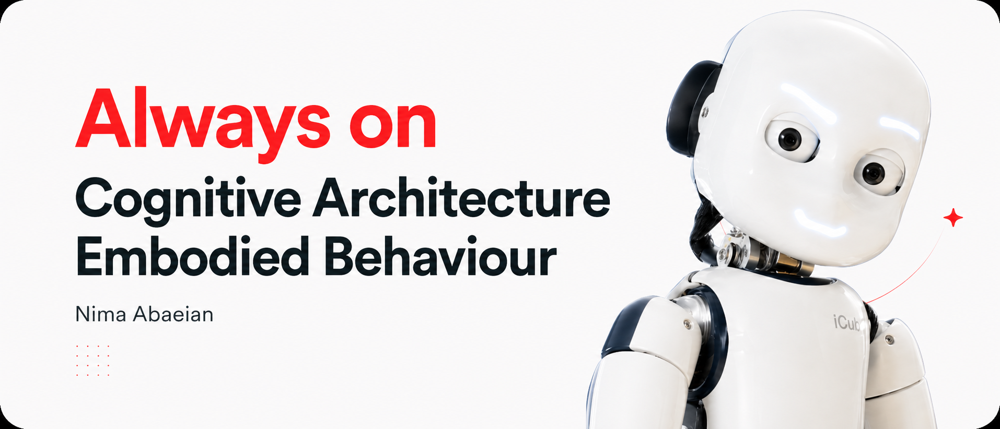
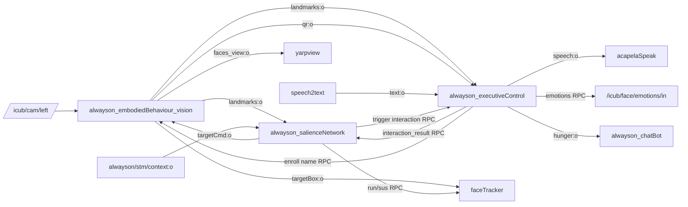

This repository provides the **embodied behaviour module** for the iCub humanoid robot, functioning as a core subsystem of the **Developmental Cognitive Architecture**
At its core, the module synthesizes a primary internal homeostatic motivation, the **Orexigenic Drive**. By embedding this drive directly into the continuous cognitive architecture, it enables the iCub to exhibit autonomous, lifelike, and drive-regulated social behaviors over extended periods.

## Tech Stack

<table>
<tr>
<td align="center" width="33%">
<br>
P R O G R A M M I N G
</td>
<td align="center" width="33%">
<br>
V I S I O N &nbsp;&amp;&nbsp; M L &nbsp;&amp;&nbsp; A I
</td>
<td align="center" width="33%">
<br>
T O O L S &nbsp;&amp;&nbsp; S T O R A G E
</td>
</tr>
<tr>
<td align="center">
<br>
<br>

</td>
<td align="center">
<br>
<br>
<br>
<br>
<br>
<br>

</td>
<td align="center">
<br>
<br>
<br>
<br>

</td>
</tr>
</table>

## Architecture Overview

**Core modules**
- **alwayson_embodiedBehaviour_vision**: Perception pipeline (YOLO + MediaPipe + face ID). Produces landmarks, annotated face view, QR data, and target bounding boxes.
- **alwayson_salienceNetwork**: Selects the most salient face via IPS, manages interaction gating and cooldowns, and drives face tracking.
- **alwayson_executiveControl**: Orchestrates the interaction state machine, speech I/O, Orexigenic drive model, QR-based feeding, and LLM-driven dialogue.
- **alwayson_chatBot**: Telegram interface driven by the same Orexigenic state and prompts.
- **alwayson_stomachMonitor**: Real-time visual monitor for the Orexigenic drive, rendering hunger level and digestion status.

**External modules**
- [speech2text]
- [acapelaSpeak]
- [faceTracker]
- [faceExpressions]

### Interaction Flow (High Level)
1. Vision processes camera frames and publishes per-face landmarks, annotated face view, and QR events.
2. SalienceNetwork ranks faces by IPS, selects a target, and streams a lightweight `targetCmd` (track ID + IPS) to vision.
3. Vision resolves the target's bounding box and streams `targetBox` to FaceTracker for gaze/pose control.
4. ExecutiveControl runs the social state machine, consuming landmarks, STT, and QR, then dispatching speech and LLM-driven responses.
5. ExecutiveControl publishes the Orexigenic state used by ChatBot for Telegram interactions.
6. ExecutiveControl returns compact interaction results (homeostatic reward, energy cost, outcome) to SalienceNetwork via RPC, tying IPS weight learning to drive reduction.

### Module Interaction Map


```mermaid
flowchart LR
  cam[/icub/cam/left/] --> V[alwayson_embodiedBehaviour_vision]
  V -->|landmarks:o| S[alwayson_salienceNetwork]
  V -->|landmarks:o| E[alwayson_executiveControl]
  V -->|qr:o| E
  S -->|targetCmd:o| V
  V -->|targetBox:o| FT[faceTracker]
  S -->|run/sus RPC| FT
  STT[speech2text] -->|text:o| E
  E -->|speech:o| TTS[acapelaSpeak]
  S -->|trigger interaction RPC| E
  E -->|interaction_result RPC| S
  E -->|enroll name RPC| V
  E -->|emotions RPC| ICUB["/icub/face/emotions/in"]
  STM[alwayson/stm/context:o] --> S
  E -->|hunger:o| C[alwayson_chatBot]
  V -->|faces_view:o| YV[yarpview]
```

## Modules and Features

### alwayson_embodiedBehaviour_vision
- **Face & Gaze Tracking**: YOLO v11 face detection + ByteTrack + MediaPipe for pose, gaze, and attention (`MUTUAL_GAZE`/`NEAR_GAZE`/`AWAY`).
- **Identity & Features**: Sticky face recognition, lip-motion talking detection, and spatial zone/distance classification.
- **Environment**: QR code detection (for feeding), optical flow, and light level estimation.

**RPC port**: `/alwayson/vision/rpc` (configurable with `rpc_name`)

---

### alwayson_salienceNetwork
- **Interaction Priority Score (IPS)**: Ranks faces dynamically by proximity, centrality, and mutual gaze. Uses hysteresis to prevent thrashing and habituation to drive novelty.
- **Adaptive Learning**: Learns a per-person homeostatic affinity scalar that modulates eligibility thresholds after interactions.
- **Social & Context Gates**: Manages social state transitions (`ss1` to `ss4`), dwell-time gates for strangers, and context-aware cooldowns to pace interactions. `ss4` faces (already greeted and talked) can re-engage when their IPS reaches 1.30, triggering an `ss3` action.
- **Persistence**: Saves daily social memory to JSON to track who was greeted or talked to.

**RPC port**: `/<module_name>` (default: `/salienceNetwork`)

---

### alwayson_executiveControl
- **Orexigenic Drive (Always-On)**: Simulates a continuous metabolism. Actions exert energy costs, pushing the robot through hunger states (HS1: full → HS2: hungry → HS3: starving). Drives both verbal requests and facial expressions.
- **Feeding Mechanisms**: Recovers energy via QR code meals, generating homeostatic rewards that accelerate reinforcement learning in the Salience Network.
- **Interaction Engine**: Orchestrates the social state machine (greeting, name extraction, LLM-driven conversation), combining proactive IPS-driven actions with reactive STT greetings.
- **High-Performance Dialogue**: Uses parallel LLM execution with cancel-on-supersede semantics and non-blocking TTS coordination for real-time responsiveness.

**RPC port**: `/<module_name>` (default: `/executiveControl`)
**Commands**:
- `status` or `ping` → module state (busy, mode, hunger level)
- `hunger <hs1|hs2|hs3>` → manually override drive state: `hs1`=full, `hs2`=hungry, `hs3`=starving
- `run <track_id> <face_id> <ss1|ss2|ss3|ss4>` → trigger an interaction manually

---

### alwayson_chatBot
- **Drive-Grounded Telegram Bot**: Driven by the exact same Orexigenic drive as the physical robot. System prompts dynamically adapt to the robot's physical hunger state.
- **Priority-Based Proactive Engagement**: Sends proactive messages when transitioning to hungry (HS2) or starving (HS3) states. A dwell-time debounce on the drive level plus per-episode latches suppress duplicate bursts from a flapping signal, so a single hunger episode yields a single transition. HS2 messages are selectively sent to the highest-priority subscribers (ranked by homeostatic affinity from `salienceNetwork`); HS3 and recovery messages reach all subscribers. Falls back to full broadcast when no learning data is available or when `proactive_mode=broadcast` is set.
- **Physical-Space Linking**: Optionally links each Telegram `chat_id` to a face-recognition `person_id` from `salienceNetwork`'s homeostatic learning data, via an explicit yes/no confirmation prompt. Confirmed links drive priority scoring; unconfirmed users always receive HS3 messages.
- **Deep Memory**: Maintains rolling conversation windows, auto-summarization, and persistent per-user psychological profiles (likes, topics, inside jokes, tone).

**RPC port**: `/chatBot/rpc`
**Commands**:
- `status` → module status (effective HS, subscriber count, thread health)
- `set_hs <HS0|HS1|HS2|HS3>` → force Orexigenic state via RPC (for testing)
- `clear_hs` → revert to physical port-driven state
- `reload_prompts` → hot-reload `prompts.json` without restarting
- `proactive_mode [broadcast|priority]` → read or set the proactive messaging mode at runtime
- `link_status [chat_id]` → show a user's link state, or a count of all subscribers by link state
- `learning_reload` → force re-read of `homeostatic_learning.json` (clears mtime cache)

---

### alwayson_stomachMonitor
- **Visual Orexigenic Drive Monitor**: A graphical interface rendering the robot's internal hunger state, stomach level, and digestion in real-time.
- **Interactive Control**: Allows manual injection of meals (QR simulation) and direct manipulation of the hunger state for debugging and demonstrations.
- **Zero-Interference**: Operates passively by polling `/executiveControl` status, ensuring it can be attached or detached without affecting the main behavior pipeline.

**Panel modes**: by default the monitor shows the **Status**, **Feed**, **Events**, and **Shutdown** sections. Pass `--full` to additionally expose the **Drive**, **State**, and **Reset** control sections for manual manipulation of the hunger drive.

**YARP connections**:
- RPC polling to `/executiveControl`
- Writes to `/alwayson/executiveControl/qr:i`

## YARP Ports and Connections

**Modules**

| Module | Type | Node |
|---|---|---|
| `alwayson_embodiedBehaviour_vision` | core | icubsrv |
| `alwayson_salienceNetwork` | core | icubsrv |
| `alwayson_executiveControl` | core | icubsrv |
| `alwayson_chatBot` | core | icubsrv |
| `alwayson_stomachMonitor` | viewer | localhost |
| `faceTracker` | external | icubsrv |
| `yarpview` | viewer | localhost |

**Data Connections**

| From | To | Protocol |
|---|---|---|
| `/icub/cam/left` | `/alwayson/vision/img:i` | tcp |
| `/alwayson/vision/faces_view:o` | `/yarpview/vision_faces_view:i` | tcp |
| `/alwayson/vision/landmarks:o` | `/alwayson/executiveControl/landmarks:i` | tcp |
| `/alwayson/vision/landmarks:o` | `/alwayson/salienceNetwork/landmarks:i` | tcp |
| `/alwayson/vision/qr:o` | `/alwayson/executiveControl/qr:i` | tcp |
| `/alwayson/vision/targetBox:o` | `/faceTracker/faceCoordinate:i` | tcp |
| `/alwayson/salienceNetwork/targetCmd:o` | `/alwayson/vision/targetCmd:i` | tcp |
| `/alwayson/stm/context:o` | `/alwayson/salienceNetwork/context:i` | tcp |
| `/alwayson/executiveControl/hunger:o` | `/alwayson/chatBot/hunger:i` | tcp |
| `/speech2text/text:o` | `/alwayson/executiveControl/stt:i` | tcp |
| `/alwayson/executiveControl/speech:o` | `/acapelaSpeak/speech:i` | tcp |
| `/acapelaSpeak/bookmark:o` | `/speech2text/bookmark:i` | tcp |

**RPC Connections** (established lazily at first use)

| From | To | Purpose |
|---|---|---|
| `/salienceNetwork/executiveControl:rpc` | `/executiveControl` | trigger interactions, get status |
| `/salienceNetwork/faceTracker:rpc` | `/faceTracker` | `run` at startup, `sus` at shutdown |
| `/executiveControl/salienceNetwork/rpc` | `/salienceNetwork` | deliver interaction results |
| `/executiveControl/vision/rpc` | `/alwayson/vision/rpc` | submit face name enrollment |
| `/executiveControl/emotions/rpc` | `/icub/face/emotions/in` | set face expression on HS change |

---

## Experimental Logging

### Metadata Fields

| Field | Description |
|---|---|
| `run_id` | Stable identifier for one experimental run. Set `ALWAYSON_RUN_ID` for shared cross-module runs. If unset, each module generates one UUID at startup. |
| `is_test_run` | `1` for pilot/debug/test runs, otherwise `0`. |
| `valid_for_analysis` | `1` for rows intended for analysis. Defaults to `0` for test runs and `1` otherwise if unset. |
| `experiment_condition` | Free-form label for the experimental arm/condition (e.g. `"baseline"`, `"drive_off"`, `"transparent"`). Stored once per DB in `schema_info`. Leave empty for single-arm studies. |

### Environment Variables

**Experiment run:**
```bash
export ALWAYSON_RUN_ID="exp01_2026_05_11"
export ALWAYSON_IS_TEST_RUN="0"
export ALWAYSON_VALID_FOR_ANALYSIS="1"
```

**Pilot/debug run:**
```bash
export ALWAYSON_RUN_ID="pilot_debug_001"
export ALWAYSON_EXPERIMENT_CONDITION="pilot"
export ALWAYSON_IS_TEST_RUN="1"
export ALWAYSON_VALID_FOR_ANALYSIS="0"
```
### Using `set_run_env.sh`

Edit [`scripts/set_run_env.sh`](scripts/set_run_env.sh) with the values for your run, then **source it** on every terminal or server where `vision`, `salienceNetwork`, `executiveControl`, or `chatBot` runs — these are the four modules that write to `.db` files and must share the same `run_id`.
---

## Installation

```bash
cmake ..
make
make install
```

## Configuration Notes (Crucial)

- **YARP**: Ensure `yarpserver` is running and network is configured.
- **LLM config**: Copy `modules/llm.env.template` to `modules/llm.env` and fill in your Azure OpenAI credentials (used by ExecutiveControl and ChatBot).
- **Face models**: Vision auto-downloads the YOLO face model on first run; ensure network access or place the model file locally. The MediaPipe `face_landmarker.task` model is bundled in the repository and installed automatically into the `alwaysOn` YARP context during `make install`.
- **Python deps**: `requirements.txt` is installed during the build; use a virtualenv if running modules manually.

## Running

Typical flow (YARP Manager or CLI):
- Load the application XML: [app/alwaysOn-embodiedBehaviour/scripts/alwaysOn-embodiedBehaviour.xml](app/alwaysOn-embodiedBehaviour/scripts/alwaysOn-embodiedBehaviour.xml)
- Start external modules (speech2text, acapelaSpeak, STM context, faceTracker)
- Run the always-on modules and establish the connections above

---

**Author:** Nima Abaeian  
**Institution:** Istituto Italiano di Tecnologia (IIT)  
**Lab:** Cognitive Architecture for Collaborative Technologies
